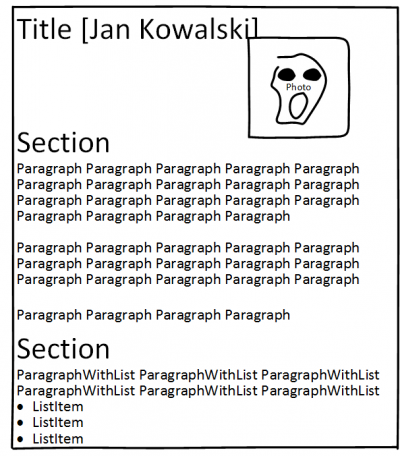
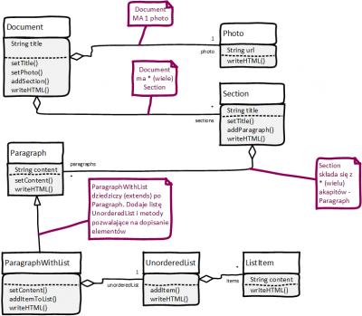

# Laboratorium 4 - piszemy CV

Zaimplementujemy kilka klas, które pozwolą na utworzenie strukturalnego dokumentu - i wypełnimy przykładowymi danymi tak, aby powstało CV.

Dokument będzie miał:

- tytuł
- zdjęcie
- składał się z kilku sekcji
- sekcje będą zawierały akapity (paragraph)
- szczególnym typem akapitu będzie akapit zawierający listę
- całość ma być zapisywana w formacie HTML (który zapewne jest dobrze znany)

## Analiza struktury

Tak wygląda dokument



A tak diagram klas



Zaimplementuj kolejne klasy

## Photo

Klasa `Photo` jest raczej prosta

```java
public class Photo {
    Photo(String url) {
        this.url = url;
    }
    String url;
    void writeHTML(PrintStream out) {
        out.printf("\n", url)
    }
}
```

## Document

Klasa powinna mieć następujące atrybuty:

```java
String title;
Photo photo;
List<Section> sections = new ArrayList<>();
```

oraz metody:

```java
Document setTitle(String title){
    this.title = title;
    return this;
}

Document setPhoto(String photoUrl){
    // ???
    return this;
}

Section addSection(String sectionTitle){
    // utwórz sekcję o danym tytule i dodaj do sections
    return ???;
}
Document addSection(Section s){
    return this;
}


void writeHTML(PrintStream out){
    // zapisz niezbędne znaczniki HTML
    // dodaj tytuł i obrazek
    // dla każdej sekcji wywołaj section.writeHTML(out)
}
```

Możesz dodać konstruktor ustalający tytuł dokumentu.

## Section

Sekcja powinna mieć następujące atrybuty:

```java
String title;
List<Paragraph> paragraps = new ArrayList<>() ;
```

oraz metody

```java
Section setTitle(String title) {...}
Section addParagraph(String paragraphText) {...}
Section addParagraph(Paragraph p) {...}
void writeHTML(PrintStream out) {...}
```

Możesz dodać konstruktor ustalający tytuł sekcji.

## Paragraph

Atrybut `content` to treść akapitu.

- Metoda `setContent()` zmienia treść
- Metoda `writeHTML()` powinna umieszczać treść pomiędzy znacznikami `<p>...</p>`
- Możesz też dodać konstruktor

## Inne klasy...

Dodaj na podstawie diagramu

- `ParagraphWithList` ma dodatkowy atrybut - listę typu `UnorederedList`; można ją wypisać wewnątrz znaczników `<p>...</p>` lub po znaczniku zamykającym.
- `UnorederedList` przechowuje na liście elementy `ListItem`
- `ListItem` zawiera wyłącznie tekst

Klasa `UnorederedList` została wprowadzona, ponieważ będzie odpowiedzialna za wypisywanie

```html
<ul>
...
...
</ul>
```

Podobnie `ListItem` ma wypisywać tekst pomiędzy znacznikami `<li>...</li>`

## Zbuduj dokument z CV

Spróbuj dobrać funkcje tak, aby budowało się w miarę wygodnie. Na przykład tak:

```java
Document cv = new Document("Jan Kowalski - CV");
cv.setPhoto("...");
cv.addSection("Wykształcenie")
    .addParagraph("2000-2005 Przedszkole im. Królewny Snieżki w ...")
    .addParagraph("2006-2012 SP7 im. Ronalda Regana w ...")
    .addParagraph("...");
cv.addSection("Umiejętności")
    .addParagraph(
        new ParagraphWithList().setContent("Umiejętności")
            .addListItem("C")
            .addListItem("C++")
            .addListItem("Java")
    );
```

Możesz wygenerować swoje CV lub wyimaginowanej osoby, ale zadbaj, aby znalazło się w nim wystarczająco dużo informacji.

## Wygeneruj kod HTML strony

Powinno to być jedno wywołanie, jak (wypisujące na konsoli)

```java
cv.writeHTML(System.out);
```

lub (wpisujące do pliku)

```java
cv.writeHTML(new PrintStream("cv.html","ISO-8859-2"));
// lub
cv.writeHTML(new PrintStream("cv.html","UTF-8"));
```

Wygeneruj poprawny składniowo dokument HTML. Możesz zastosować zdefiniowane w nagłówku style CSS, aby zapewnić ładne formatowanie.

## Napisz testy

Głównym celem klas jest generacja kodu w HTML. Testy powinny więc sprawdzać głównie poprawność generacji: obecność znaczników i danych w wygenerowanym kodzie...

Co może być sprawdzone dla wyjścia typu ``?

Przykład implementacji

```java
public class PhotoTest {
    @org.junit.Test
    public void writeHTML() throws Exception {
        String imageUrl = "jan-kowalski.png";
        // Utwórz strumień zapisujący w pamięci
        ByteArrayOutputStream os = new ByteArrayOutputStream();
        PrintStream ps = new PrintStream(os);
        // Utwórz obiekt i zapisz do strumienia
        new Photo(imageUrl).writeHTML(ps);
        String result = null;
        // Pobierz jako String
        try {
            result = os.toString("ISO-8859-2");
        } catch (UnsupportedEncodingException e) {
            e.printStackTrace();
        }
 
        // System.out.println(result);
 
        // Sprawdź, czy result zawiera wybrane elementy
        assertTrue(result.contains(""));
        assertTrue(result.contains("src="));
        assertTrue(result.contains(imageUrl));
    }
}
```

Napisz testy sprawdzające poprawność generacji kodu dla **trzech** wybranych klas.
